Day 05 Agenda: Let’s focus on the target service and process. We’ll also take a quick look at CPU and memory usage, disk and IO operations, network activity, and review the logs. Finally, we’ll share our initial observations and discuss any next steps if things don’t improve.
--------------------------------------------------------------------------------------------
# Mini Runbook for ssh service 
# Environment Basic
- uname -a : this prints Kernel name, version , architecture and system-info
         : Used for quickly identifying OS kernel and architecture.
         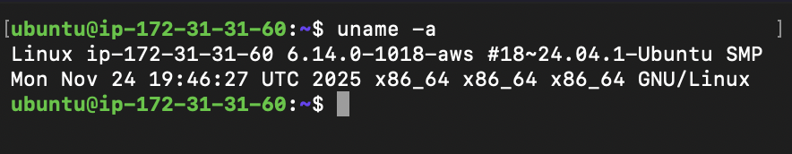

- cat /etc/os-release : this display Linux distribution details
         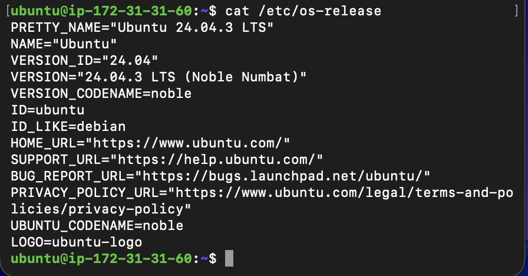

- ubuntu@ip-172-31-31-60:~$ lsb_release -a
        No LSB modules are available.
        Distributor ID:	Ubuntu
        Description:	Ubuntu 24.04.3 LTS
        Release:	24.04
        Codename:	noble
--------------------------------------------------------------------------------------------
# File-System Sanity
- mkdir /tmp/runbook-demo : creates a directory 
  : verifying file-system write permissions.
- cp /etc/hosts /tmp/runbook-demo/hosts-copy 
   :Copies a file & Testing read/write functionality on the filesystem.
- ls -l /tmp/runbook-demo : list files with detailed metadata like permission , owner , size
      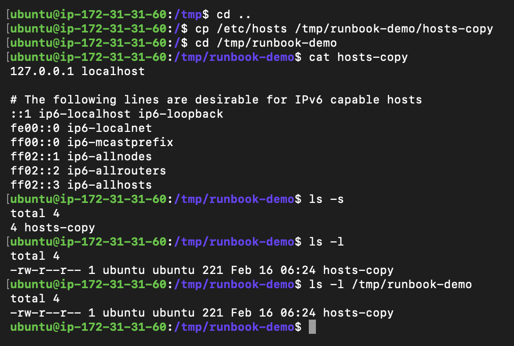
--------------------------------------------------------------------------------------------
# CPU and memmory Usage

- systemctl status ssh : it shows ssh service status, PID, uptime, and recent logs and confirms service is running and identifying its main process ID.

   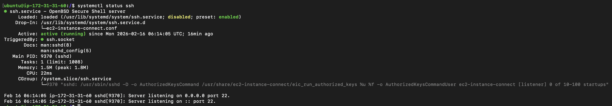

- ps -o pid,pcpu,pmem,comm -p 731 : this shows CPU%, memory%, and command name for a mentioned pid (731 is the process pid).
- free -h : shows total , used and available memory.
    
    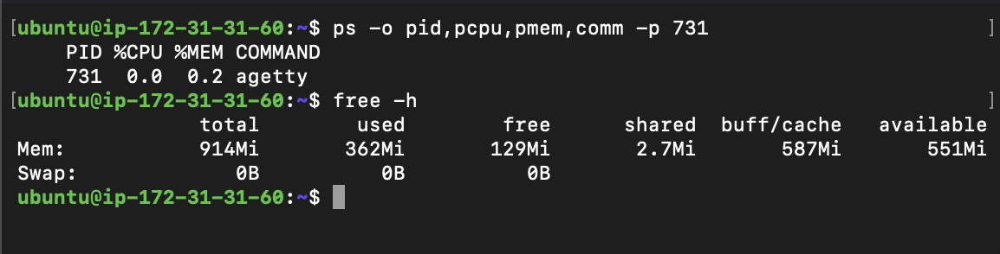

--------------------------------------------------------------------------------------------
# Disk input/output Operations 

1. df -h : this displays disk usage by filesystems 
2. du -sh /var/log : this shows total size of a directory named log

    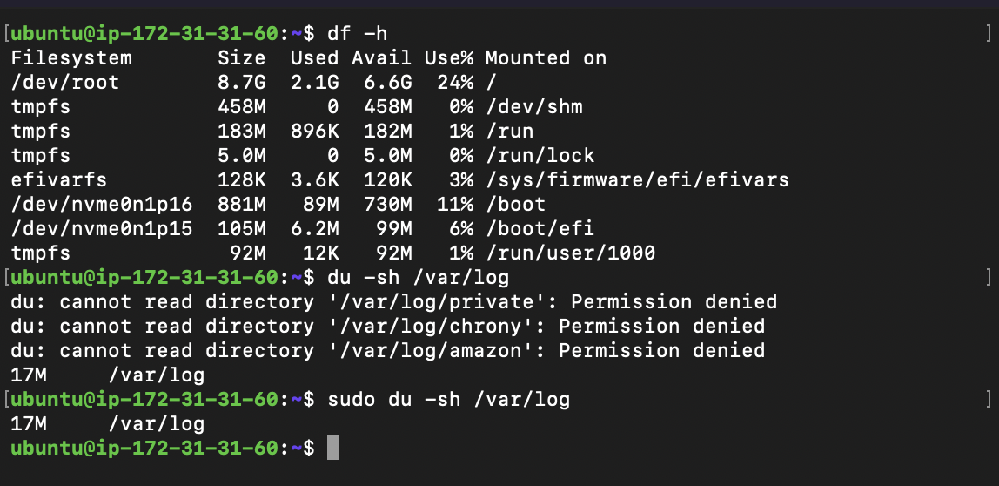

--------------------------------------------------------------------------------------------
# Network Operation 

1. ss -tulpn : where tulnp means show me all TCP (t), UDP (u) , Process (p) numeric (n)     ports that are listening currently and tell me which process owns them without DNS resolution.
- ss -tulpn | grep 80
- ss -tulpn | grep 8080 
   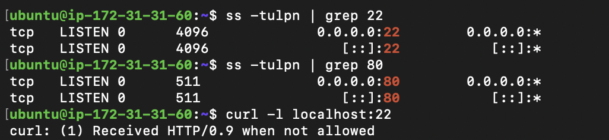

- curl -l localhost:22  : this command  Sends a request and returns headers only.
  Expected Output: "curl: (1) Received HTTP/0.9 when not allowed"  means confirms port 80 is open but not for http (22 is for ssh)
- curl -l localhost:80 " this will give http response as nginx is hosted on port 80"
    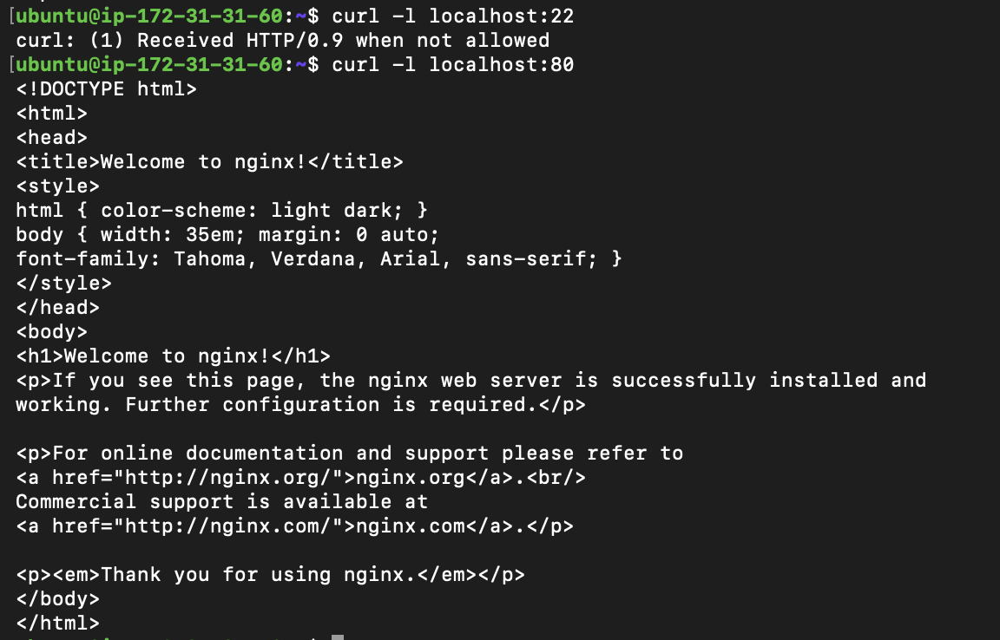

- ping -c 3 localhost : this commannd Sends ICMP packets to test reachability
     
     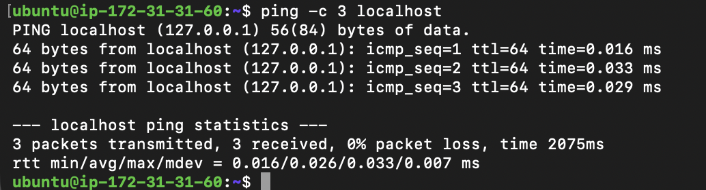

--------------------------------------------------------------------------------------------
# Log Operations

1. journalctl -u ssh -n 50 : this shows last 50 log entries for systemd service ssh

   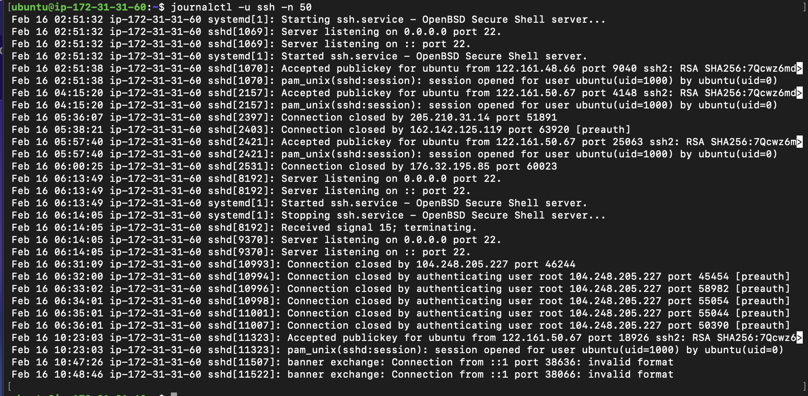
   - oberserved no error in the log for ssh service , its mentioned ssh is listening on port no 22 and all the process when .ssh service was started and stopped.

2. tail -n 50 /var/log/auth/log 
   - this displays last 50 lines for a log file preferred to inspect recent authentication  and errors.
   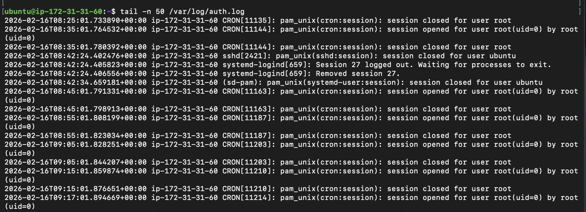

--------------------------------------------------------------------------------------------
- To summarize : CPU looks normal , memory is healthy and clean no swap , disk usage : 24%, Logs are clean , Network ports : listening correctly as per this port 22 (ssh) and port 80 nginx.

--------------------------------------------------------------------------------------------

- If the situation worsens I would follow below stategy to troubleshoot:
  - Restart Strategy
    1. systemctl restart ssh
    2. systemctl status ssh 
  - Logging Verbosity 
   
    1. edit /etc/ssh/sshd_config:
       LogLevel VERBOSE
       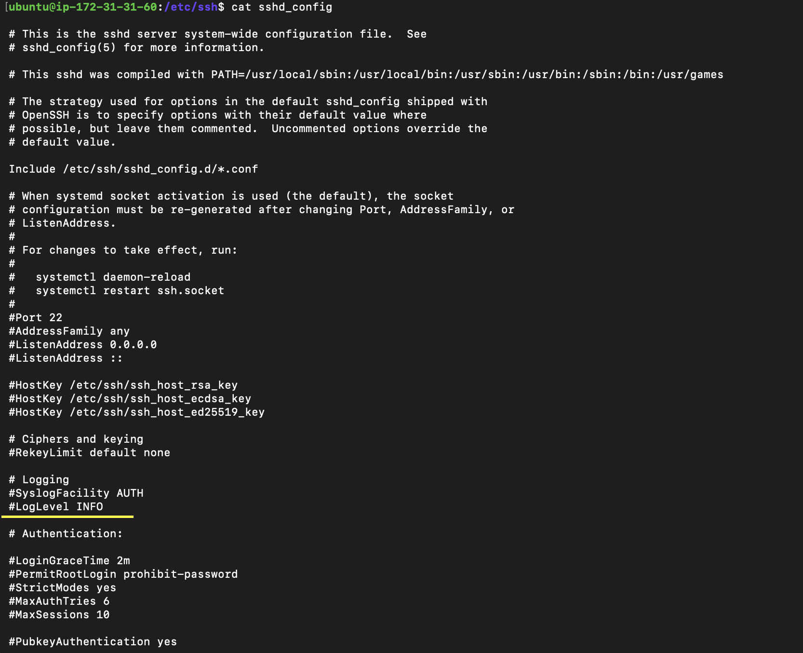
       
       then systemctl restart ssh

