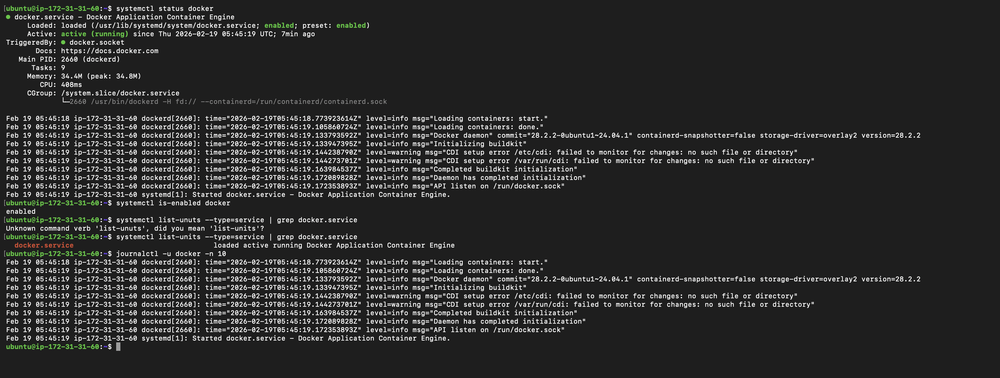

### Part 1: Linux File System Hierarchy (30 minutes)

**Core Directories (Must Know):**
- `/` (root) - The starting point of everything
- `/home` - User home directories
- `/root` - Root user's home directory
- `/etc` - Configuration files
- `/var/log` - Log files (very important for DevOps!)
- `/tmp` - Temporary files

**Additional Directories (Good to Know):**
- `/bin` - Essential command binaries
- `/usr/bin` - User command binaries
- `/opt` - Optional/third-party applications

For each directory:
- '/' : This is top level directory , everything in linux starts from here.
      - Directories I see in ec2 instnace under root folder are :
      - bin, boot, dev, etc, home,lib, root,sbin, tmp, usr,mnt,system
      - I would use this when I need to navigate to major system directories.

- '/home' : This is home directory for regular users.
      - Directory I see here is ubuntu which is a user  :
      - I would use this to access user files or to configure user environments.

- '/root' : This is home directory of the root user.
      - Directory I see here is ubuntu which is a user  :
      - I would use this to manage administrative scripts or configs as root.

- '/etc' : This is system-wide configuration files for the OS, services, and installed applications.
      - Directory I see here are hosts, ssh, adduser.conf etc :
      - I would use this when I need to modify system or service configuration like SSH, networking, DNS.

- '/var/log' : this directory stores System and application log files .
      - Directory I see here are syslog, auth.log, dmesg, etc :
      - I would use this for monitoring, troubleshooting, and auditing.

- '/tmp' : This is temporary file directory .
      - files created by applications and users, tmp files get cleared on system reboot.
      - I would use this when I need short term storage for temporary scripts, test-files etc.

- '/bin' : this directory contains  core system commands required for booting and basic system functionality.
      - Directory or commands I see here are ls ,mv , bash , systemctl, systemd, cp , cat, ps etc.
      - I would use when I need to verify or troubleshoot availability of essential system commands

- '/usr/bin' : this directory stores most user-level command-line programs and utilities.
      - Directory or commands I see here git , python3 , bash etc.
      - I would use this when I need to confirm installed applications or check executable path.


**Hands-on task:**
```bash
# Find the largest log file in /var/log
du -sh /var/log/* 2>/dev/null | sort -h | tail -5
- ubuntu@ip-172-31-31-60:~$ du -sh /var/log/* 2>/dev/null | sort -h | tail -5
  124K	/var/log/kern.log
  160K	/var/log/sysstat
  236K	/var/log/cloud-init.log
  460K	/var/log/syslog
  27M	/var/log/journal

==

# Look at a config file in /etc
cat /etc/hostname

- ubuntu@ip-172-31-31-60:~$ cat /etc/hostname
  ip-172-31-31-60
  thi shows entry of the IP address of this ec2 instance

# Check your home directory
ls -la ~
```
- ubuntu@ip-172-31-31-60:/home$ ls -la
- total 12
  - drwxr-xr-x  3 root   root   4096 Feb 16 02:51 .
  - drwxr-xr-x 22 root   root   4096 Feb 19 03:14 ..
  - drwxr-x---  6 ubuntu ubuntu 4096 Feb 16 14:56 ubuntu
  - this shows only ubuntu user has full access and its group has read-execute permission , only ubuntu user and its group can access this folder other users cannot.
---

### Part 2: Scenario-Based Practice (40 minutes)

**Important:** Focus on understanding the **troubleshooting flow**, not memorizing commands. Use the hints!

---

#### SOLVED EXAMPLE: Understanding How to Approach Scenarios

**Example Scenario: Check if a service is running**
```
Question: How do you check if the 'nginx' service is running?
```

**My Solution (Step by step):**

**Step 1:** Check service status
```bash
systemctl status nginx
```
**Why this command?** It shows if the service is active, failed, or stopped

**Step 2:** If service is not found, list all services
```bash
systemctl list-units --type=service
```
**Why this command?** To see what services exist on the system

**Step 3:** Check if service is enabled on boot
```bash
systemctl is-enabled nginx
```
**Why this command?** To know if it will start automatically after reboot

**What I learned:** Always check status first, then investigate based on what you see.

---

Now try these scenarios yourself:

---

**Scenario 1: Service Not Starting** 
```
A web application service called 'myapp' failed to start after a server reboot.
What commands would you run to diagnose the issue?
Write at least 4 commands in order.
```
**I have installed docker application in my instance**
 - sudo apt install docker.io 
 - then checked status of docker with command "systemctl status docker "
 - then "systemctl list-units --type=service" to check docker service exist on the system or not
 - then checked if the app is enabled for restart after reboot " systemctl is-enabled docker"
 - then checked log entires of docker with command : " journalctl -u doccker -n 50"
    
    
    